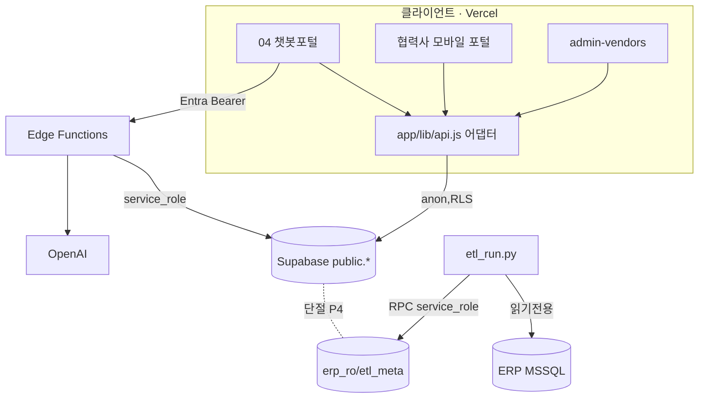

# 03 · 시스템 아키텍처 설계서

> 관리자: 최동혁(dh.choi@jeilm.co.kr) · 기준일: 2026-07-08 · 상태: Draft
> 관련: [00 개요](00_제품기획_개요.md) · [04 DB설계](04_데이터베이스_설계.md) · [05 FE·BE](05_프론트엔드_백엔드_설계.md) · [06 ERP연계](06_ERP연계_챗봇활용_설계.md) · [07 이관](07_마이그레이션_Azure이관_설계.md)

이 문서는 **시스템의 구조·경계·데이터 흐름·확장 지점**을 정의한다. 다이어그램은 ASCII를 정본으로 하고, 필요 시 Mermaid 코드블록을 병기한다(현재 빌더는 Mermaid를 렌더링하지 않음).

---

## 1. 설계 원칙 (아키텍처 결정의 뿌리)

1. **3계층 데이터 분리** — 원천(ERP) / 읽기사본(중간DB) / 자체생성(포털DB)을 물리 분리. 프론트는 ERP에 직접 붙지 않는다.
2. **읽기/쓰기 물리 분리** — ERP는 읽기전용, 포털 데이터는 별도 스키마에 쓰기.
3. **권한은 백엔드/DB에서** — 프론트 메뉴 숨김은 UX. 실제 차단은 RLS·Edge Function.
4. **데이터 접근 단일 진입점** — 프론트의 모든 조회/저장은 `app/lib/api.js` 한 곳을 통과(어댑터 교체점).
5. **비밀값 분리** — service_role·OpenAI·Entra Secret은 서버(Edge Function/Secrets)에만. 프론트는 publishable anon 키만.
6. **이관 무영향 설계** — 스택/호스팅 교체는 어댑터 경계에서 흡수(→ [07](07_마이그레이션_Azure이관_설계.md)).

## 2. 상위 아키텍처 (현재 실동작)

```
                          ┌───────────────────────── 클라이언트 (브라우저/모바일) ─────────────────────────┐
                          │  정적 HTML + 바닐라 ESM · Vercel(jeil-ax) 배포 · HTTPS 강제                     │
                          │                                                                              │
   사내 직원 ─Entra SSO──▶ │  04_챗봇_포털  ·  pages/부서페이지  ·  app/admin-vendors                        │
   협력사 ─Supabase Auth─▶ │  vendor-login  ·  pages/협력사_모바일_포털  ·  외주발주_검사진행현황              │
                          │            │                         │                                       │
                          │   app/lib/api.js (어댑터 단일 진입점)  │ (Entra access_token)                   │
                          └────────────┼─────────────────────────┼───────────────────────────────────────┘
                                       │ supabase-js(anon,RLS)    │ Bearer(Entra)
                                       ▼                          ▼
             ┌─────────────────────────────────────┐   ┌─────────────────────────────────────┐
             │  Supabase 데이터 플랫폼               │   │  Supabase Edge Functions (Deno)      │
             │  PostgreSQL                          │   │  service_role · Deno.env 시크릿      │
             │   public.*  (RLS 격리)               │◀──│  vendor-provision / approve-vendor    │
             │   erp_ro.* / etl_meta.* (REST 비노출) │   │  vendor-reset-password                │
             │  Auth(협력사) · Realtime · Storage    │   │  jeil-chat / jeil-chat-admin ──▶ OpenAI│
             └───────────────▲─────────────────────┘   └─────────────────────────────────────┘
                             │ RPC(service_role) erp_etl_upsert/batch
                             │
             ┌───────────────┴───────────────┐
             │  ETL 배치 (사내 PC, Python)     │  읽기전용 SELECT + NOLOCK + 파라미터 바인딩
             │  etl_run.py (화이트리스트 5종)  │◀──────────────  ERP 운영DB (UNIERP · MSSQL · 사외 IDC)
             └───────────────────────────────┘                   ※ 직접 접근은 ETL만, 프론트/챗봇 금지
```

Mermaid(참고):



## 3. 컴포넌트 맵

| 계층 | 컴포넌트 | 기술 | 책임 |
|---|---|---|---|
| 프론트 | 포털/부서/협력사 화면 | 바닐라 JS+HTML(ESM) | UI·상호작용 |
| 프론트 | `app/lib/api.js` | ESM 어댑터 | 데이터 접근 단일 진입점(supabase↔mock↔azure) |
| 프론트 | `app/lib/supabaseClient.js` | supabase-js(PKCE) | 세션·클라이언트 |
| 프론트 | `app/lib/grid.js` | 바닐라 컴포넌트 | 표준 편집 그리드 |
| 백엔드 | Edge Functions ×5 | Deno/TypeScript | 특권작업(계정·챗봇·감사) |
| 데이터 | PostgreSQL `public` | Supabase | 포털 데이터 + RLS |
| 데이터 | `erp_ro`/`etl_meta` | Supabase | ERP 사본 + 배치메타(REST 비노출) |
| 데이터 | Storage `vendor-photos` | Supabase Storage | 사진(비공개, 서명 URL) |
| 데이터 | Realtime | Supabase | postgres_changes 구독 |
| 연계 | `etl_run.py` 등 | Python(pyodbc) | ERP→중간DB 배치 |
| 인증 | Entra ID | Microsoft | 사내 SSO+MFA |

## 4. 게이트웨이 5모듈 (논리적 책임 경계)

물리적으로는 Edge Function + RLS로 나뉘지만, 논리적 책임은 5개다(협력사 포털 정본 [`08/03/01`](../08_협력사발주포털/03_실구축기획/01_아키텍처_데이터흐름_연계설계.md)과 정합):

1. **AuthN/AuthZ** — Entra(사내)·Supabase Auth(협력사) 검증, claim→RLS.
2. **ERP Query** — 중간DB 읽기전용 조회(현재 챗봇 Tool 3종, 향후 부서 뷰/RPC). ERP 원천 직접 없음.
3. **Portal Write** — 발주 상태·사진·검수·메시지 쓰기(RLS로 주체 격리).
4. **File** — 업로드 검증·비공개 스토리지·단기 서명 URL.
5. **Realtime/Notify** — 상태·사진·메시지 실시간 반영.

## 5. 인증 3경로 (시퀀스)

### 5.1 사내 직원 — Entra ID (OAuth PKCE, MSAL 미사용)

```
브라우저 ──(1) authorize?code_challenge(S256)──▶ login.microsoftonline.com
        ◀─(2) redirect ?code ────────────────────
        ──(3) /token (code + verifier, Secret 불필요) ─▶
        ◀─(4) access_token(+refresh, offline_access) ──
        저장: localStorage 'jeilax_auth'   MFA: 조건부 액세스가 자동 강제
챗봇 호출: Authorization: Bearer <access_token>
        Edge Function 'jeil-chat' ──▶ graph.microsoft.com/me 로 검증(@jeilm.co.kr)
```

### 5.2 협력사 — Supabase Auth

```
vendor-login ──signInWithPassword(email,pw)──▶ Supabase Auth
        ◀── JWT(app_metadata.role=vendor, vendor_bp=[bp_cd]) ──
        Custom Access Token Hook가 role·vendor_bp 주입 → RLS가 자기 거래처만 허용
        저장: localStorage 'jeilax_sb_auth' (Entra와 storageKey 분리)
```

### 5.3 사내 관리자 — Supabase 세션 + portal_admin

```
admin-vendors ── 세션 claim role=internal 확인 ── + portal_admin 테이블 등록 조회
        통과 시 Edge Function(vendor-provision 등) 호출 가능
```

> **경계 원칙**: 협력사(사외)는 사내 Entra 테넌트에 넣지 않는다([CLAUDE.md §5.5]). Entra↔Supabase는 Edge Function이 Graph 검증으로 잇는 **브리지**.

## 6. 배포 토폴로지 (현재)

```
GitHub main ──(push 자동배포)──▶ Vercel 프로젝트 'jeil-ax'
     ├─ ai.jeilm.co.kr (운영)     ┐ 둘 다 같은 프로젝트 main
     └─ ax.jeilm.co.kr (데모)     ┘
Supabase 프로젝트 dvzohdqtjzocgcclgwro (Postgres·Auth·Edge·Storage)
ETL: 사내 PC에서 수동/야간 실행(현재), 운영 전환 시 서버/스케줄러
```

- 상세 배포·계정·시크릿 현황은 값 복제 없이 → [`이관/00_현재시스템_상태스냅샷`](../실제구축준비%20자료/이관/00_현재시스템_상태스냅샷.md).
- 환경 분리(local/staging/prod)와 스테이징 도메인(`ai-dev.jeilm.co.kr`)은 계획 단계([CLAUDE.md §11-B]).

## 7. 기술스택 현황·평가

| 항목 | 현재 | 대안/방향 | 결정상태 |
|---|---|---|---|
| 프론트 | 바닐라 ESM | Next.js 등 프레임워크 | 미확정(현행 유지 중) |
| 백엔드 | Supabase Edge(Deno) | .NET(ERP 백엔드) / Node BFF | 미확정([09 ADR](09_ADR_의사결정기록.md)) |
| DB | Supabase Postgres | Azure DB for PostgreSQL | 이관 계획([07](07_마이그레이션_Azure이관_설계.md)) |
| 챗봇 LLM | OpenAI gpt-4o-mini | Claude(UI 표기와 정합) | 미결정(불일치 이슈, 09) |
| 호스팅 | Vercel | Azure vs 사내 IIS | 미확정([CLAUDE.md §11-B]) |

## 8. 어댑터 경계 (확장·이관의 핵심)

**"재구축이 아니라 어댑터 교체"** 전략의 물리적 지점:

| 경계 | 파일/지점 | 교체 대상 | 흡수하는 변화 |
|---|---|---|---|
| 데이터 접근 | `app/lib/api.js` (`DATA_BACKEND` 스위치, `supabaseAdapter`/`mockAdapter`) | `azureAdapter` 추가 | Supabase→Azure DB/API |
| 세션 | `app/lib/supabaseClient.js` | Azure Auth 클라이언트 | 인증 백엔드 교체 |
| 설정 | `app/config.js` | 환경변수/URL | 프로젝트·엔드포인트 |
| 서버 로직 | Edge Functions | Azure Functions/Container Apps | 서버리스 런타임 |
| 시크릿 | `.env`/Supabase Secrets | Azure Key Vault | 시크릿 저장소 |

이 경계 덕에 화면 코드를 건드리지 않고 백엔드를 바꿀 수 있다. 상세 매핑 → [07 이관](07_마이그레이션_Azure이관_설계.md).

## 9. 알려진 아키텍처 이슈 (→ [09 ADR](09_ADR_의사결정기록.md))

- **P4 단절**: `erp_ro`가 앱/챗봇에 노출되지 않아 부서 페이지가 정적 샘플. [06](06_ERP연계_챗봇활용_설계.md)에서 해소 설계.
- **챗봇 표기/구현 불일치**: UI="Claude", 구현=OpenAI.
- **토큰 보관**: localStorage(XSS 노출) → BFF/HttpOnly 미전환.
- **스택·호스팅 미확정**: 하이브리드 권고만, 확정 전.
